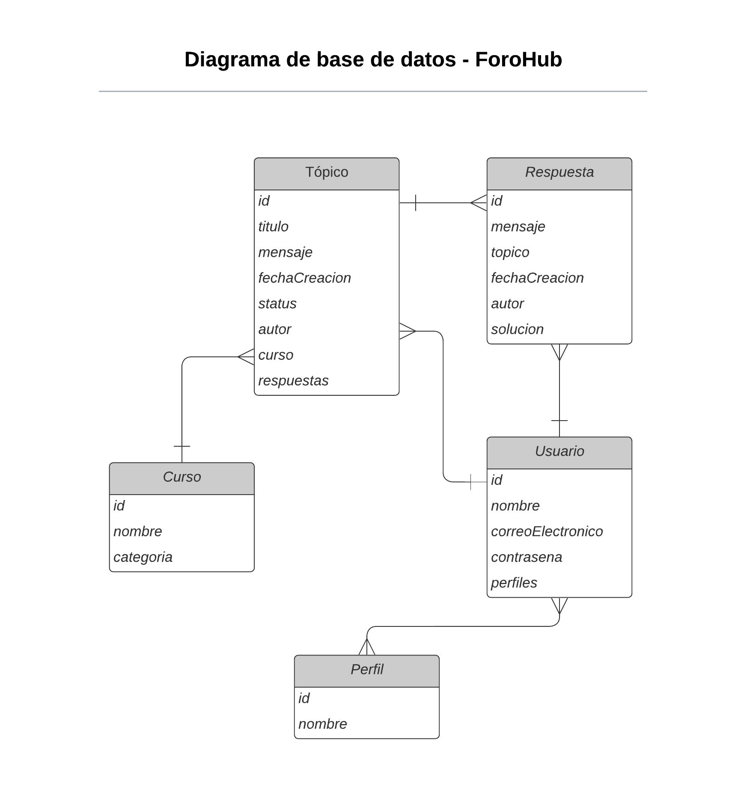

<div align="center">
   <h1>Challenge ONE | Java | Back End - SpringBoot | API REST - Foro Alura</h1>
</div>


<p align="center">
  
  <br>
  
  
</p>

<p align="center" >
     
</p>

<p align="center">
<strong>Martin Sanabria </strong></br>
</p>

## Índice

* [Descripción del proyecto](#descripción-del-proyecto)

* [Estado del proyecto](#estado-del-proyecto)

* [️Características del Proyecto](#características-del-Proyecto)

* [Acceso al proyecto](#acceso-proyecto)

* [Tecnologías utilizadas](#tecnologías-utilizadas)

# Descripción del proyecto
<p>Esta aplicación que se ha desarrollado esta destinada a realizar las funciones que describe su propio nombre, en este repositorio solo esta realizado el apartado de Back-End.

Este es un Challenge proporcionado por Alura Latam.

Esta api desarrollada le permitira a los usuarios:

Crear un nuevo tópico
Mostrar todos los tópicos creados
Mostrar un tópico específico
Actualizar un tópico
Eliminar un tópico.</p>


### Lo que se solicitó para la aplicación:
1. Sistema de autenticación para el usuario para que pueda gestionar los recursos.
2. Permitir Mostrar todos los datos, mostrar dato especifico, crear, editar y eliminar un Topico, Respuesta, Curso o un Usuario.
3. Base de datos para almacenar todos los datos pedidos anteriormente.


# Estado del proyecto
<p>
   
</p>


# Características del Proyecto
1. Funcionalidades
   
   
   
   

### Tablas de la Base de Datos Foro Alura:
- Recomendacion: Crear primero la BD y sus tablas luego codificar en Eclipse o Intellij IDEA.

## Documentacion del proyecto
1. Funcionalidades
* Enlaces TRELLO de referencia:
    * https://trello.com/b/lj8N7Ng9/foro-alura-challenge-one-springboot
* Diseño de la BD:
    * 
# Acceso al proyecto
### ¿Cómo descargar?
### Pasos principales:


#### Fork
1. Haga el **Fork** del proyecto. En la parte superior derecha, al hacer clic en el icono, creará un repositorio del proyecto en su cuenta personal de GitHub.

#### Clonar el repositorio

1. Clonar repositorio:

```zsh
git clone https://github.com/TBBN147/ForoAplicacion.git
```
2. Ir al directorio del proyecto:

```zsh
cd ForoAplicacion
```
3. Abrir el proyecto en Intellij IDEA:

```zsh
Listo
```

# Tecnologías utilizadas
-  Java 17
- JPA Hibernate
- [Intellij](https://www.jetbrains.com/idea/)
- [pgAdmin](https://www.pgadmin.org/)
- [Java](https://www.java.com/en/)
- [Spring Security](https://start.spring.io/)
- [SpringDog](https://springdoc.org/)
- [Token JWT](https://jwt.io/)


